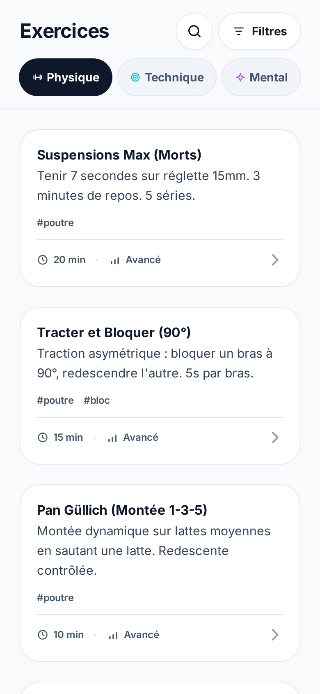
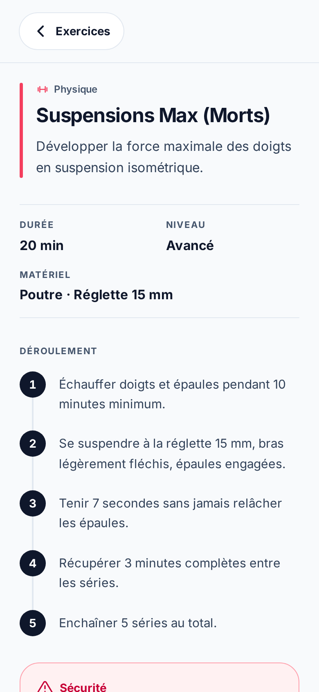

<div align="center">
  
  <h1>AscendBox</h1>
  <p><em>The exercise toolbox for climbing coaches.</em></p>

  <p><strong><a href="https://www.ascendbox.fr">www.ascendbox.fr</a></strong> - live, installable, works offline.</p>

  <p>
    <a href="https://github.com/PHBasin/ascendbox/actions/workflows/ci-cd.yml"></a>
    <a href="https://github.com/PHBasin/ascendbox/actions/workflows/codeql.yml"></a>
    <a href="https://github.com/semantic-release/semantic-release"></a>
    <a href="LICENSE.md"></a>
  </p>

  <p>
    
    
    
    
  </p>

  <p>
    
    
  </p>
</div>

---

**AscendBox** is a _mobile-first_ web app that lets climbing-club coaches browse a catalog of
training exercises, filtered by category (**Physique**, **Technique**, **Mental** - strength, technique,
mental) and qualified by level and duration.

> Exercise content is in French; the code and comments are in English.

## ✨ Features

- 🎯 **Category scope** - Physique, Technique, Mental, each with its own icon + identity color.
- 🔍 **Collapsible search** - a magnifier expands into a field; when used it searches the whole catalog (title, teaser, tags - case/accent-insensitive), overriding the category scope.
- 🎛️ **Attribute filters** - a bottom sheet refines the feed by duration, level and tags (multi-select), with an active-count badge and removable chips.
- 📊 **At-a-glance reading** - every card shows duration, up to 3 tags and a neutral 3-segment level gauge with its label (no meaning carried by colour alone).
- 📖 **Exercise detail page** - a shareable route (`/#/exercice/12`) with the objective, a numbered step-by-step, adaptations and any safety warning; each section renders only when its data exists.
- ♾️ **Infinite scroll** - automatic pagination on scroll (with prefetch).
- 🌗 **Light / dark theme** - automatic, follows the operating-system setting.
- 📱 **Mobile-minded** - touch targets ≥ 44px, single-column feed, sticky filter bar.
- 📶 **Installable PWA** - service worker + manifest; the app shell, the exercise data and the Inter latin subsets are precached, so it works **fully offline** at the crag and auto-updates on a new deploy.

## 🚀 Getting started

**Prerequisites**: Node.js **24.18.0** (see [`.nvmrc`](.nvmrc)) and npm.

```bash
nvm use          # align the Node version with .nvmrc
npm install      # install dependencies
npm run dev      # start the dev server at http://localhost:3000
```

## 📜 Scripts

| Command                 | Description                                                                                                       |
| ----------------------- | ----------------------------------------------------------------------------------------------------------------- |
| `npm run dev`           | Vite development server (port **3000**).                                                                          |
| `npm run build`         | Production build into `dist/`.                                                                                    |
| `npm run preview`       | Serve the production build locally.                                                                               |
| `npm run type-check`    | Type-checking via `vue-tsc` (emits no files).                                                                     |
| `npm run lint`          | ESLint over the project, auto-fixing where possible (`--fix`).                                                    |
| `npm run lint:ci`       | ESLint with no auto-fix - the exact gate CI runs.                                                                 |
| `npm run validate:data` | Check `exercises.json` against the `Exercise` contract (`--verbose` lists every editorial warning).               |
| `npm run data:export`   | JSON → CSV for spreadsheet editing (`-- --out fichier.csv`; default `exercises.csv`, gitignored).                 |
| `npm run data:import`   | CSV → JSON (`-- --in fichier.csv`).                                                                               |
| `npm run format`        | Prettier write across the project ([`.prettierrc`](.prettierrc): 100 cols, single quotes, `es5` trailing commas). |

> 📄 **`data:import` converts; it does not check.** Editing ~150 exercises is a job for a spreadsheet,
> so the catalogue round-trips through a `;`-separated, BOM'd CSV that a French Excel opens without an
> import wizard. The converter refuses only what would make the conversion _unfaithful_ (a `|` inside
> a value, a mismatched header, a file with no data row - which would otherwise erase the catalogue
> silently). Judging the **content** is `validate:data`'s job: run it as a separate second step after
> every import. `git checkout` is the undo.

> ℹ️ There is **no test runner yet**, but correctness is enforced **statically**:
>
> - a **hardened `tsconfig`** checked by `vue-tsc` - `strict` plus `noUncheckedIndexedAccess`,
>   `noImplicitReturns`, `noFallthroughCasesInSwitch`, `verbatimModuleSyntax`, `noImplicitOverride`,
>   `noUnusedLocals`, `noUnusedParameters`, `allowUnreachableCode: false`…
> - **type-aware ESLint** (`typescript-eslint` _recommendedTypeChecked_ via `projectService`), which
>   catches type-level bugs `vue-tsc` compiles through - e.g. floating promises. `eslint-config-prettier`
>   switches off the rules that would fight the formatter; formatting itself is a separate pass
>   (`npm run format`), not an ESLint rule.
> - **`validate:data`**, which closes the one hole the two above cannot see: the catalogue JSON is
>   fetched, not imported, so no compiler reads it.
>
> None of the three runs during `dev` or `build` - a green build is not type-, lint- or data-clean.
> CI runs all three plus a **Lighthouse accessibility gate** on every push and pull request.
>
> They prove the app _compiles_; only a browser proves it _lays out_. The `visual-check` skill
> ([`.claude/skills/visual-check/`](.claude/skills/visual-check/)) screenshots the app at fixed
> viewports and fails on horizontal overflow - it exists because a metrics-only check once passed
> green while `Technique` rendered as `Techniq…`.

## 🧱 Tech stack

- [Vue 3](https://vuejs.org/) (`<script setup>` + Composition API) with [Vue Router](https://router.vuejs.org/)
- [Vite 8](https://vitejs.dev/) (bundler & dev server) + [`vite-plugin-pwa`](https://vite-pwa-org.netlify.app/)
- [TypeScript](https://www.typescriptlang.org/) (`strict` + hardened compiler flags)
- [Tailwind CSS v4](https://tailwindcss.com/) (_CSS-first_ config, no `tailwind.config.js`)
- [Inter](https://rsms.me/inter/) - **self-hosted** (`@fontsource-variable/inter`), no third-party request

> Runtime dependencies are deliberately kept to three: `vue`, `vue-router` and the font.

## 🏗️ Architecture

The project follows a **layered architecture** (Clean-Architecture-inspired) so that the data
source can be swapped without touching the UI. Dependencies flow in a single direction:

```
domain  →  data  →  application  →  presentation
```

| Layer            | File                                                               | Role                                                                                                                                                                                                                                                                                         |
| ---------------- | ------------------------------------------------------------------ | -------------------------------------------------------------------------------------------------------------------------------------------------------------------------------------------------------------------------------------------------------------------------------------------- |
| **Domain**       | [`src/domain/exercise.ts`](src/domain/exercise.ts)                 | Pure business entities & types. Single source of truth for the closed vocabularies - `CATEGORIES` and `LEVELS`, with their label records derived from them. Zero framework dependency.                                                                                                       |
| **Data**         | [`src/data/exerciseRepository.ts`](src/data/exerciseRepository.ts) | The only module that knows the source. `fetch`es the JSON, **validates the payload**, freezes and caches it, and aborts after 10 s. Swap it to move to an API.                                                                                                                               |
| **Application**  | [`src/application/`](src/application/)                             | State as a shared singleton, split by owner: `useCatalogue` (data + load/retry), `useSearch`, `useFilters`, `usePagination`, `useExercises` as the façade, and `plural` (French agreement). Behavior lives here, not in components.                                                          |
| **Presentation** | [`src/views/`](src/views/) + [`src/components/`](src/components/)  | One component per route (`HomeView`, `ExerciseView`) over an `App.vue` that is only a `<RouterView>`, plus presentational components - `HeaderToolbar`, `CategoryScope`, `ExerciseFeed`, `ExerciseCard`, `FilterSheet`, `LevelGauge`, `CategoryBadge`, `ToggleChip` and the `icons/` glyphs. |

- **Path alias**: `@` → `./src` (declared in both `vite.config.ts` **and** `tsconfig.json`).
- **Routing**: [`src/router/index.ts`](src/router/index.ts) - **hash** history (`/#/exercice/12`), because GitHub Pages is a static host with no rewrite rule.
- **No duplicated look**: repeated Tailwind strings live as classes in `@layer components`
  ([`main.css`](src/assets/main.css)); the category palette lives in
  [`categoryStyles.ts`](src/components/categoryStyles.ts) and the shared toggle recipe in
  [`toggleStyles.ts`](src/components/toggleStyles.ts); a glyph used more than once is a component
  in [`src/components/icons/`](src/components/icons/). See [DESIGN.md §10/§11](DESIGN.md).
- **Failures are values, not sentences**: the repository raises a `CatalogueError` carrying a `kind`
  (`network` / `timeout` / `http` / `malformed`). Infrastructure knows what broke; `useCatalogue` is
  the single place that turns that into French copy, and every failure state offers **`Réessayer`**.
- **Design system**: see [DESIGN.md](DESIGN.md).
- **Deeper architecture notes**: [`.claude/CLAUDE.md`](.claude/CLAUDE.md) is the internal reference -
  it carries the reasoning behind each layer, and is where work in flight is tracked. This README
  stays the short version on purpose.

## 📂 Data

Exercises live in [`public/data/exercises.json`](public/data/exercises.json), **fetched at runtime**
(out of the JS bundle for a better _time-to-interactive_; preloaded via `<link rel="preload">` in
[`index.html`](index.html)).

The catalogue holds **149 exercises** (measured 2026-08-22). Each entry conforms to the `Exercise` interface: seven fields
are required, and the rest feed the detail page (DESIGN §5.6) and are **optional by design** - the
catalogue is authored incrementally, and a section with no data simply does not render.

```json
{
  "id": 1,
  "title": "Suspensions Max (Morts)",
  "teaser": "Tenir 7 secondes sur réglette 15mm. 3 minutes de repos. 5 séries.",
  "categoryId": "physique",
  "tags": ["poutre"],
  "level": 3,
  "duration": 20,

  "objective": "Développer la force maximale des doigts en suspension isométrique.",
  "equipment": ["Poutre", "Réglette 15 mm"],
  "instructions": ["Échauffer doigts et épaules pendant 10 minutes minimum.", "…"],
  "variants": { "harder": ["Descendre sur une réglette 12 mm.", "…"], "easier": ["…"] },
  "safety": "Échauffement complet obligatoire (doigts + épaules). …"
}
```

- `categoryId`: `"physique"` | `"technique"` | `"mental"`.
- `level`: `1` (low) | `2` (moderate) | `3` (high).
- `duration`: in minutes.
- **`teaser` ≠ `objective` ≠ `instructions`** - three surfaces, not one field. The teaser is the
  card's hook and says _what you do_; the objective is the detail's subtitle and says _what it buys
  you_; `instructions` is the step-by-step, one bullet per step. The detail never echoes the teaser.
- **There is no `protocol`.** Figures live inside `instructions` prose, in the unit a coach says out
  loud ("3 min", never "180 s") - a fixed vocabulary of `reps`/`sets`/`restSec` could not describe a
  hand-authored catalogue (DESIGN §5.6).

**Authoring status** (2026-08-22): `objective` and `instructions` are complete on all 149 entries;
`equipment` is on 52, `variants` on 35 and `safety` on 8.

> Because the JSON is _fetched_ (not imported), `vue-tsc` cannot see it - a schema drift would only
> fail at runtime, in the field. **`npm run validate:data` is the gate that closes this** and runs in
> CI: it checks every entry against the contract and exits non-zero on a violation. Its field table is
> a mapped type over `keyof Required<Exercise>`, and each field's `required` flag is derived from the
> interface's optionality, so **changing the interface fails `type-check` until the validator is
> updated** - the check cannot fall behind what it checks.

## 🔄 CI/CD & security

Two GitHub Actions workflows run on every push and pull request to `main`. Every action is pinned to
a **commit SHA**, not a tag, and dependency installation is shared through the composite action
[`.github/actions/setup`](.github/actions/setup/action.yml) (Node from `.nvmrc`, npm cache, `npm ci`).

### `CI/CD` - [`.github/workflows/ci-cd.yml`](.github/workflows/ci-cd.yml)

Triggered on push and PR to `main`, and manually (`workflow_dispatch`). The Quality Gate gates
everything; build and Lighthouse then run **in parallel**, and only the build branch continues to
release and deploy:

```
🛡️ Quality Gate ─┬─ ⚒️ Build Application ── 📦 Semantic Release ── 🚀 Deploy to Production
                 └─ 🔦 Lighthouse
```

1. **🛡️ Quality Gate** - `type-check` (`vue-tsc`), `lint:ci` and `validate:data`.
2. **⚒️ Build Application** - `npm run build`, then uploads `dist/` as a GitHub Pages artifact.
3. **🔦 Lighthouse** - audits the build with [Lighthouse CI](https://github.com/GoogleChrome/lighthouse-ci) ([`lighthouserc.json`](lighthouserc.json)): **accessibility ≥ 0.95** as an _error_, best-practices ≥ 0.9 as a _warning_. Independent of the release/deploy chain.
4. **📦 Semantic Release** - on `main`, for a push or a manual dispatch. Runs [semantic-release](https://semantic-release.gitbook.io/): version tag and GitHub release notes driven by commit messages. No `CHANGELOG.md` is committed - the notes live on the [Releases](https://github.com/PHBasin/ascendbox/releases) page.
5. **🚀 Deploy to Production** - publishes the artifact to GitHub Pages (`production` environment, custom domain via [`public/CNAME`](public/CNAME)). It fires when a release actually happened, or unconditionally on a manual dispatch.

Concurrency is grouped per ref with **`cancel-in-progress: false`** - a semantic-release run must
never be interrupted mid-publish.

### `Security Analysis` - [`.github/workflows/codeql.yml`](.github/workflows/codeql.yml)

[CodeQL](https://codeql.github.com/) scanning on push and PR to `main`, plus a weekly schedule
(Mondays, 00:00 UTC). Analyzes the `javascript-typescript` and `actions` languages with the
`security-extended` + `security-and-quality` query suites.

### Dependencies

[Dependabot](.github/dependabot.yml) opens weekly PRs for both npm and GitHub Actions, with the
`github/codeql-action*` sub-actions grouped into a single PR rather than three.

> 💡 Because commit messages drive releases, follow
> [Conventional Commits](https://www.conventionalcommits.org/) (`feat:`, `fix:`, `chore:`, `ci:`, `docs:`, `style:`, `refactor:`, `perf:`, `test:`…).

## 🗂️ Project structure

```
ascendbox/
├── .github/
│   ├── actions/setup/        # composite action: Node + npm ci
│   ├── workflows/            # CI/CD (ci-cd.yml) & security (codeql.yml)
│   └── dependabot.yml
├── docs/                     # README assets (not deployed, not precached)
├── public/                   # served as-is at the site root
│   ├── data/exercises.json   # the exercise catalog
│   ├── favicon.svg           # logo (isometric cube + chevron)
│   ├── CNAME                 # custom domain
│   └── pwa-*.png, apple-touch-icon.png, maskable-512x512.png
├── scripts/
│   ├── validate-data.ts      # the data-contract gate
│   └── exercises-csv.ts      # JSON ⇄ CSV, for spreadsheet editing
├── src/
│   ├── domain/               # entities & types
│   ├── data/                 # data access
│   ├── application/          # state & logic (5 composables + plural.ts)
│   ├── router/               # routes (hash history)
│   ├── views/                # one component per route
│   ├── components/           # Vue components
│   │   ├── icons/            # glyphs used in 2+ places
│   │   ├── categoryStyles.ts # the category palette, as classes
│   │   ├── toggleStyles.ts   # the shared toggle recipe
│   │   └── useFocusTrap.ts   # focus containment for modal surfaces
│   ├── assets/main.css       # Tailwind v4 tokens (@theme) + shared classes
│   ├── App.vue               # shell: <RouterView> and nothing else
│   └── main.ts               # entry point
├── index.html
├── vite.config.ts            # dev server, PWA manifest & precache, path alias
├── postcss.config.js         # @tailwindcss/postcss
├── lighthouserc.json         # the accessibility gate
├── .releaserc.json           # semantic-release
├── .claude/CLAUDE.md         # guide for the AI assistant
└── DESIGN.md                 # design system
```

## 🚧 Roadmap

Possible directions, grouped by theme. None is blocking - the project works as-is.
Work actually in flight is tracked in [`.claude/CLAUDE.md`](.claude/CLAUDE.md), not here.

### Quality & robustness

- **Tests** - there are no tests yet. Add [Vitest](https://vitest.dev/) for the logic
  ([`src/application/`](src/application/): filtering, pagination, the search index) and
  [Vue Test Utils](https://test-utils.vuejs.org/) for the components, then wire them into the
  Quality Gate. **Automated accessibility assertions** (axe-core) come with the same setup, and
  splitting `tsconfig.json` into app/node projects is the step that unblocks it.

### Features

- **Favorites** for exercises (persisted in `localStorage`).
- **Session builder** - pick exercises to assemble a training session. DESIGN §5.6 already keeps the
  detail page's sticky footer out of scope until this exists.

### Technical

- **TypeScript 7** - held back, not skipped: the native compiler rewrite is stable, but
  `typescript-eslint` still requires `typescript <6.1.0`, so upgrading would break type-aware
  linting. Pinned to `^6.0.0` until that peer range moves.

### Content

- **Finish the detail data** - `equipment` (52/149), `variants` (35/149) and `safety` (8/149) are
  still partial. Content authoring, not code: the model is settled and every section self-hides, so
  a gap is a non-event. `safety` is the one field that cannot be bulk-filled - it is coaching advice,
  so it needs a human who coaches.
